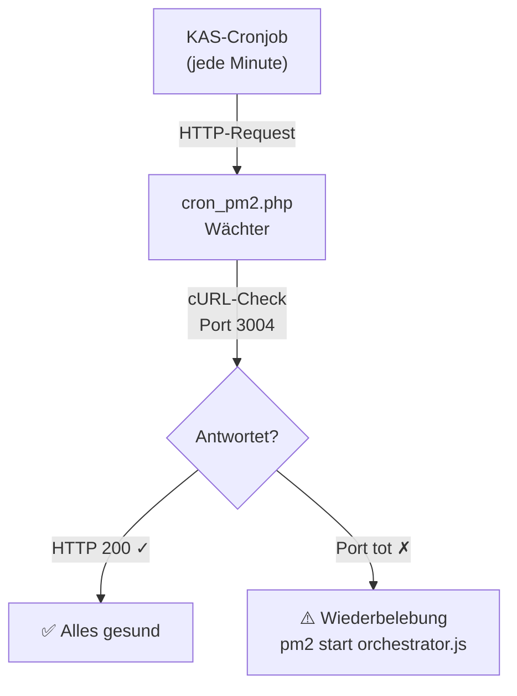
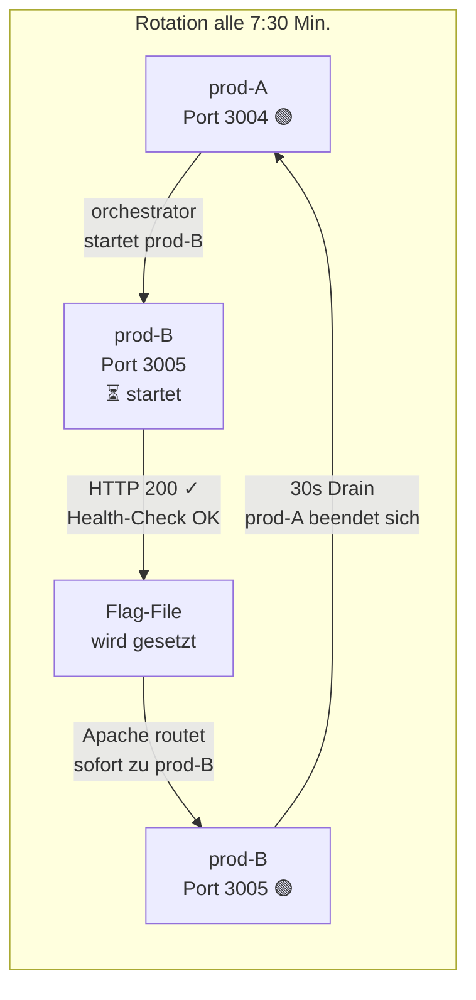

Wer eine Next.js-App dauerhaft auf einem Shared-Hosting-Paket betreiben will, stößt sehr schnell auf ein bestimmtes Problem: Die App läuft – und dann plötzlich nicht mehr. Kein Fehler, kein Hinweis, nichts. Der Prozess ist einfach weg.

Das ist kein Bug. Das ist das Design des Systems.

## Warum Shared Hosting Node.js tötet

Shared Hosting ist für PHP gebaut. PHP-Skripte sind von Natur aus kurzlebig: Ein Besucher öffnet eine Seite, PHP springt für 200 Millisekunden an, liefert HTML aus – und stirbt wieder. Kein dauerhafter Prozess, kein RAM-Verbrauch zwischen den Anfragen.

Node.js funktioniert komplett anders. Eine Node.js-App läuft als permanenter Hintergrunddienst. Sie horcht 24/7 auf einem Port, hält Verbindungen offen, verwaltet einen internen Arbeitsspeicher-Cache. Genau das ist das Problem auf Shared Hosting: Dort teilen sich Hunderte Kunden dieselbe Hardware. Ein permanent laufender Prozess eines einzelnen Kunden kann die Stabilität aller anderen gefährden.

Deshalb gibt es auf jedem Shared-Hosting-Server automatisierte Wächter, die regelmäßig alle nicht autorisierten Hintergrundprozesse bereinigen.

Bei meinem Hoster All-Inkl habe ich das empirisch gemessen: **Der Reaper schlägt exakt alle 11–12 Minuten zu.**

## Die Lösung: Ein Watchdog, der den Watchdog überlistet

Die erste Lösung war ein simpler PHP-Watchdog: Ein PHP-Skript, das jede Minute per KAS-Cronjob aufgerufen wird, den Node.js-Port prüft und bei einem Ausfall PM2 neu startet. Das hat funktioniert – die maximale Downtime-Zeit war auf unter 60 Sekunden reduziert.

Das zweite Problem: Diese Lösung reagiert. Sie heilt, nachdem der Schaden passiert ist. Besucher, die genau in diesen 60 Sekunden kommen, sehen eine 503-Fehlermeldung.

## Das Flip-Flop-System: Proaktiv statt reaktiv

Die elegantere Lösung ist ein proaktives System: Anstatt zu warten bis der Hoster den Prozess tötet, töten wir ihn selbst – aber erst nachdem ein frischer Ersatz-Prozess vollständig hochgefahren ist.

Die Idee: Zwei Node.js-Instanzen auf zwei verschiedenen Ports. Ein Orchestrator-Skript rotiert sie alle 7,5 Minuten – deutlich bevor der 11-Minuten-Reaper zuschlägt.

Das Schöne daran: Das Routing in der `.htaccess` wechselt erst dann auf die neue Instanz, wenn diese nachweislich antwortet. Die Datei `port_b_active.flag` existiert nur, wenn prod-B tatsächlich bereit ist. Apache liest dieses Signal in jeder Millisekunde neu.

**Ergebnis: Zero Downtime.** Kein Besucher bemerkt den Wechsel.

## Was mit laufenden Verbindungen passiert

Eine berechtigte Frage: Was passiert, wenn gerade jemand etwas herunterlädt oder einen Stream empfängt?

Die Antwort liegt im Graceful Shutdown. Der Orchestrator beendet die alte Instanz nicht mit einem harten `SIGKILL`, sondern mit `SIGTERM`. Node.js fängt dieses sanfte Signal auf und stoppt, neue Verbindungen anzunehmen – aber lässt alle bestehenden, offenen Verbindungen zu Ende laufen. 30 Sekunden lang. Erst danach schließt sich der Prozess.

Für fast alle Web-Anfragen (Seiten, API-Calls) ist das irrelevant – die dauern Millisekunden. Für lange Downloads oder Streams ist es die Garantie, dass sie nicht abrupt abbrechen.

## Der Cronjob bleibt als letztes Sicherheitsnetz

Auch mit dem Flip-Flop-System bleibt der PHP-Watchdog aktiv – aber in einer reduzierten Rolle. Er prüft jetzt beide Ports gleichzeitig und greift nur noch ein, wenn **beide** tot sind. Das passiert dann, wenn der Hoster nicht nur die Node.js-Prozesse, sondern den kompletten PM2-Daemon aus dem Speicher fegt – inklusive des Orchestrators selbst.

In diesem Szenario startet der Cronjob nicht einfach Node.js neu, sondern startet den Orchestrator. Der wiederum kümmert sich um alles Weitere.

## Fazit

Shared Hosting ist architektonisch nicht für permanente Hintergrunddienste gedacht. Aber mit dem richtigen System lässt sich das kompensieren:

- **PHP** erledigt den minütlichen Notfall-Check
- **Der Orchestrator** rotiert proaktiv und verhindert Downtime
- **Apache** routet per Flag-File ohne jede Latenz zum richtigen Port
- **SIGTERM** schützt laufende Verbindungen beim Wechsel

Das gesamte System ist vollständig dokumentiert – inkl. aller Konfigurationsdateien, Skripte und der genauen Messdaten aus den Live-Logs:

→ [Vollständige technische Dokumentation: PM2 & Node.js auf All-Inkl Shared Hosting](/docs/pm2-setup-hetzner)
