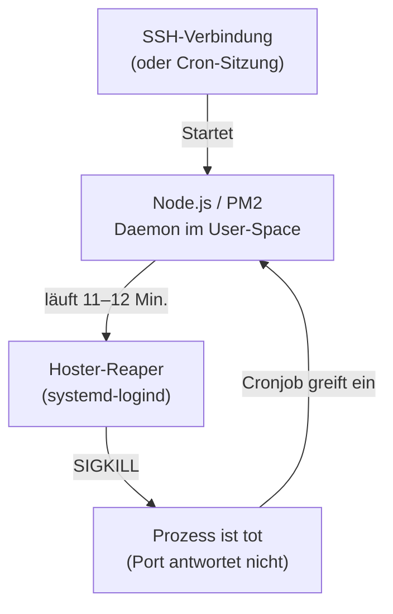
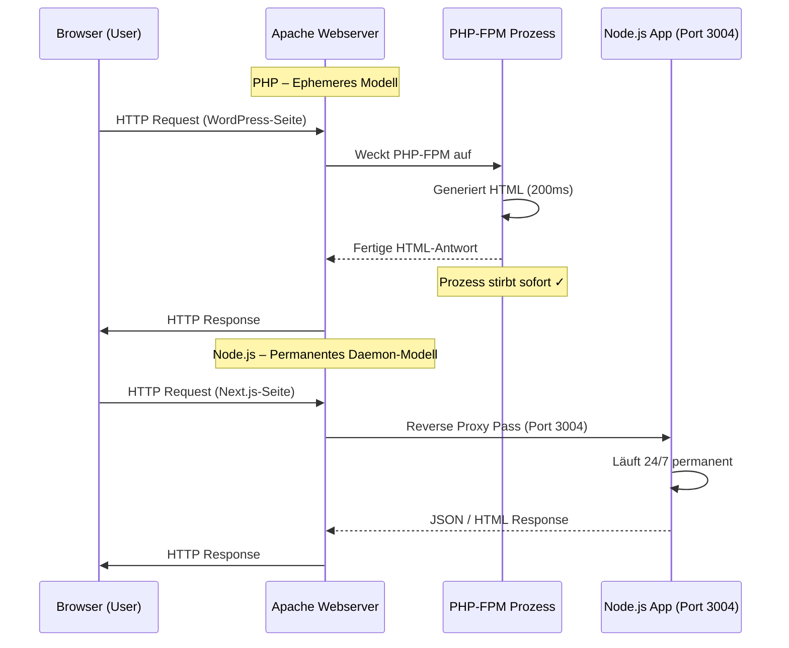
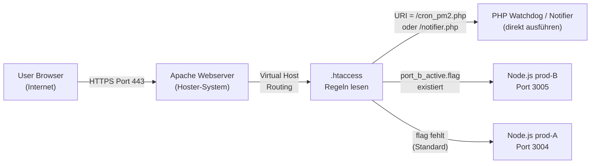

> Stand: 2026-05-18 | Technische Dokumentation & Best Practices
> Zielgruppe: System-Architekten, KI-Agenten, DevOps-Engineers

---

## 1. Architektur-Spezifika & Besonderheit von Shared Hosting

- **Ausgangslage im Shared Hosting**
  - *All-Inkl.com* ist kein isolierter virtueller Server (*vServer* / *VPS*)
  - Mehrere Kunden teilen sich die Hardwareressourcen und denselben Linux-Kernel (`6.8.0-111-generic Ubuntu`)
  - Fehlende `sudo`- bzw. Root-Rechte für Systemdienste (`systemctl` nicht verfügbar)
  - Isolierte SSH-Shell: `SHELL=/usr/local/bin/ssh-bash`

- **Das Problem der flüchtigen Prozesse (Der 11-Minuten-Reaper)**
  - Auf Shared-Systemen beendet die Hoster-Überwachungsroutine inaktive oder ressourcenintensive Hintergrundprozesse
  - Empirisch beobachtetes Intervall bei All-Inkl: **exakt alle 11–12 Minuten**
  - Ein regulär gestarteter Node.js-Prozess läuft nicht garantiert unendlich durch
  - Ursachen: `systemd-logind KillUserProcesses=yes`, RAM-Limits, CPU-Quotas



- **Die Lösungsarchitektur (3 Ebenen)**
  1. **Flip-Flop-Orchestrator** (`orchestrator.js`): Proaktive Rotation alle 7:30 Min. zwischen 2 Ports
  2. **PHP-Watchdog** (`cron_pm2.php`): Minütlicher KAS-Cronjob als Notfall-Defibrillator
  3. **Apache Reverse Proxy** (`.htaccess`): Flag-File-basiertes Zero-Downtime-Routing

---

## 2. Systemarchitektur: PHP vs. Node.js (Ephemerisch vs. Permanent)

Der Hauptgrund, warum Node.js auf Shared-Hosting stirbt, während PHP stabil läuft:



- **PHP** läuft im FastCGI/FPM-Modus unter Apache
  - Existiert nur für die Dauer eines Requests (100–500ms)
  - Kein dauerhafter Hintergrundprozess im Kunden-User-Space
  - Der Apache-Webserver ist ein unantastbarer Systemdienst des Hosters

- **Node.js** bringt seinen eigenen Webserver mit
  - Läuft dauerhaft 24/7 im unprivilegierten User-Space (`ssh-USER`)
  - Belegt permanent Arbeitsspeicher (V8-Engine) und Netzwerk-Sockets (Port `3004`)
  - Stirbt beim Reaper → Site ist offline bis zur Wiederbelebung

---

## 3. Pfadstrukturen & Laufzeitumgebung (All-Inkl)

- **Verzeichnisstruktur bei All-Inkl**
  - `/www/htdocs/ACCOUNT_ID/`
    - Kunden-Homeverzeichnis auf dem Shared-Server
  - `/www/htdocs/ACCOUNT_ID/DEINE-DOMAIN/`
    - Domain-Root und Projektverzeichnis
  - `/www/htdocs/ACCOUNT_ID/DEINE-DOMAIN/app/`
    - Next.js Standalone-Build-Verzeichnis
  - `/www/htdocs/ACCOUNT_ID/DEINE-DOMAIN/app/server.js`
    - Ausführbarer Next.js Server-Einstiegspunkt
  - `/www/htdocs/ACCOUNT_ID/nodejs_current/bin/`
    - Pfad zu Node.js & npm Binaries
  - `/www/htdocs/ACCOUNT_ID/.pm2_1/`
    - `PM2_HOME` für Slot A (isoliert)
  - `/www/htdocs/ACCOUNT_ID/.pm2_2/`
    - `PM2_HOME` für Slot B (isoliert)

- **Architektonische Details der Pfad-Isolation**
  - *Zwei getrennte PM2-Verzeichnisse* (`.pm2_1` und `.pm2_2`)
    - Verhindern Daemon-Kollisionen bei RPC-Sockets und Signalen
    - Slot A und Slot B laufen auf komplett isolierten Daemons
    - Unabhängiges Stoppen/Starten ohne gegenseitige Beeinflussung
  - *Explizite Pfaddeklarationen für PHP-Cronjobs*
    - PHP im Web-Userkontext besitzt standardmäßig keine Umgebungspfade
    - `HOME` und `PATH` müssen bei jedem Shell-Befehl explizit exportiert werden:
      - `export HOME=/www/htdocs/ACCOUNT_ID`
      - `export PATH=/www/htdocs/ACCOUNT_ID/nodejs_current/bin:$PATH`

---

## 4. Die Flip-Flop-Architektur (Zero-Downtime Rotation)

Das Kernkonzept: Zwei permanent laufende Node.js-Instanzen auf unterschiedlichen Ports rotieren proaktiv alle 7:30 Minuten – **bevor** der 11-Minuten-Reaper des Hosters sie beendet.


### 4.1 Die 4 Säulen der Stabilität (Troubleshooting-Lehren)

- **1. Isolierte PM2-Home-Verzeichnisse (`PM2_HOME`)**
  - *Problem*: Teilen sich beide Slots dasselbe standardmäßige PM2-Home (`~/.pm2`), blockieren sich die RPC-Schnittstellen
  - *Auswirkung*: Ein `pm2 kill` auf Slot A beendet auch Slot B fälschlicherweise
  - *Lösung*: Slot A läuft unter `/www/htdocs/ACCOUNT_ID/.pm2_1`, Slot B unter `/www/htdocs/ACCOUNT_ID/.pm2_2`

- **2. Vermeidung von Watcher-Endlosschleifen (`--ignore-watch`)**
  - *Problem*: Der PM2-Dateiwächter ist auf Shared-Hosting-Paketen oft standardmäßig für das gesamte Web-Root aktiv
  - *Auswirkung*: Da PM2 Logdateien und Sockets in `.pm2_x` schreibt, triggert jeder Schreibvorgang einen Wächter-Neustart (Looping / High CPU)
  - *Lösung*: Alle Start-Befehle müssen zwingend `--ignore-watch /www/htdocs/ACCOUNT_ID` enthalten, um das Home-Verzeichnis zu ignorieren

- **3. Umgebungsvariablen-Sanitisierung (`getCleanEnv`)**
  - *Problem*: Startet Slot A den Slot B via PM2-Prozess-Forking, vererbt er seine internen Umgebungsvariablen (`PM2_HOME`, `name`, `namespace` etc.)
  - *Auswirkung*: Slot B versucht fälschlicherweise, mit dem Daemon von Slot A zu kommunizieren
  - *Lösung*: Der Orchestrator filtert alle PM2-internen Umgebungsvariablen beim Spawnen heraus, um eine saubere Prozess-Isolation sicherzustellen

- **4. Socket-Lockups bereinigen**
  - *Problem*: Bei unsauberem Shutdown verbleiben die Kommunikations-Sockets (`rpc.sock` und `pub.sock`) im PM2-Verzeichnis
  - *Auswirkung*: Ein nachfolgender Start schlägt mit `Permission Denied` oder Timeout fehl
  - *Lösung*: Vor dem Start eines neuen Daemons löschen wir diese verwaisten Sockets vorsorglich (`rm -f ...`)

---

## 5. Apache Reverse Proxy & `.htaccess` Konfiguration (All-Inkl)



### 5.1 Die vollständige `.htaccess` (Flip-Flop-Variante)

```apache
# 1. DirectoryIndex zwingend deaktivieren
DirectoryIndex disabled
RewriteEngine On

# 2. Watchdog- & Notifier-Skript: immer direkt als PHP ausführen, NIEMALS proxieren
#    (Muss erreichbar bleiben, wenn Node.js down ist)
RewriteCond %{REQUEST_URI} ^/(cron_pm2|notifier)\.php
RewriteRule ^ - [L]

# 3. Wenn port_b_active.flag existiert → prod-B (Port 3005) ist live und ready
RewriteCond %{DOCUMENT_ROOT}/port_b_active.flag -f
RewriteRule ^(.*)$ http://127.0.0.1:3005%{REQUEST_URI} [P,L]

# 4. Standard-Routing: prod-A (Port 3004)
RewriteRule ^(.*)$ http://127.0.0.1:3004%{REQUEST_URI} [P,L]
```

---

## 6. Der Orchestrator (`orchestrator.js`)

Der Orchestrator läuft als permanenter PM2-Prozess im jeweiligen Slot und regelt den nahtlosen Handover.

### 6.1 Vollständiger Code (`orchestrator.js`)

```javascript
#!/usr/bin/env node
/**
 * Dual PM2 Ping-Pong Orchestrator for deine-domain.de (Anonymisiert)
 * =================================================================
 */

const { execSync } = require("child_process");
const http = require("http");
const fs = require("fs");

// --- Konfiguration ---
const WEBROOT    = "/www/htdocs/ACCOUNT_ID/DEINE-DOMAIN";
const APPDIR     = WEBROOT + "/app";
const PM2        = "/www/htdocs/ACCOUNT_ID/nodejs_current/bin/pm2";
const HOME       = "/www/htdocs/ACCOUNT_ID";
const PATH_ENV   = "/www/htdocs/ACCOUNT_ID/nodejs_current/bin:" + process.env.PATH;

const PORT_A     = 3004;
const PORT_B     = 3005;
const NAME_A     = "prod-A";
const NAME_B     = "prod-B";
const HOME_A     = HOME + "/.pm2_1";
const HOME_B     = HOME + "/.pm2_2";
const FLAG_B     = WEBROOT + "/port_b_active.flag";

const ROTATE_INTERVAL_MS = 7.5 * 60 * 1000; // 7,5 Minuten
const HEALTH_TIMEOUT_MS  = 30 * 1000;       // 30s Start-Timeout
const DRAIN_TIMEOUT_MS   = 15 * 1000;       // 15s Graceful Drain

const args = process.argv.slice(2);
const isSlotB = args.includes("--slot") && args[args.indexOf("--slot") + 1] === "B";

const selfSlot   = isSlotB ? "B" : "A";
const selfPort   = isSlotB ? PORT_B : PORT_A;
const selfName   = isSlotB ? NAME_B : NAME_A;
const selfHome   = isSlotB ? HOME_B : HOME_A;
const selfOrch   = isSlotB ? "orchestrator_B" : "orchestrator_A";

const otherSlot  = isSlotB ? "A" : "B";
const otherPort  = isSlotB ? PORT_A : PORT_B;
const otherName  = isSlotB ? NAME_A : NAME_B;
const otherHome  = isSlotB ? HOME_A : HOME_B;
const otherOrch  = isSlotB ? "orchestrator_A" : "orchestrator_B";

function log(msg) {
  const now = new Date().toISOString().replace("T", " ").substring(0, 19);
  const line = "[" + now + "] [ORCH_" + selfSlot + "] " + msg + "\n";
  process.stdout.write(line);
  const logDir = HOME + "/watchdog_logs";
  if (!fs.existsSync(logDir)) {
    try { fs.mkdirSync(logDir, { recursive: true, mode: 0o755 }); } catch (_) {}
  }
  const logFile = logDir + "/orchestrator-" + new Date().toISOString().substring(0, 10) + ".log";
  try { fs.appendFileSync(logFile, line); } catch (_) {}
}

/**
 * Bereinigt die Umgebungsvariablen von PM2-internen Werten,
 * um eine saubere Prozess-Isolation der Daemons zu garantieren.
 */
function getCleanEnv(pm2Home) {
  const cleanEnv = {};
  for (const key in process.env) {
    const lowerKey = key.toLowerCase();
    if (
      !lowerKey.startsWith("pm2_") &&
      !lowerKey.startsWith("pm_") &&
      !lowerKey.startsWith("axm_") &&
      !lowerKey.startsWith("npm_") &&
      lowerKey !== "node_app_instance" &&
      lowerKey !== "vizion" &&
      lowerKey !== "name" &&
      lowerKey !== "namespace"
    ) {
      cleanEnv[key] = process.env[key];
    }
  }
  cleanEnv.HOME = HOME;
  cleanEnv.PM2_HOME = pm2Home;
  cleanEnv.PATH = PATH_ENV;
  cleanEnv.NODE_ENV = "production";
  return cleanEnv;
}

function checkPort(port, cb) {
  let done = false;
  const req = http.get({ hostname: "127.0.0.1", port: port, path: "/", timeout: 3000 }, (res) => {
    res.resume();
    if (!done) { done = true; cb(res.statusCode >= 200 && res.statusCode < 500); }
  });
  req.on("error", () => { if (!done) { done = true; cb(false); } });
  req.on("timeout", () => { req.destroy(); if (!done) { done = true; cb(false); } });
}

function startSelf() {
  log("Starting up on Port " + selfPort + " under PM2_HOME " + selfHome);
  
  // Vorbeugende Socket-Bereinigung bei Start
  try {
    if (fs.existsSync(selfHome + "/rpc.sock")) fs.unlinkSync(selfHome + "/rpc.sock");
    if (fs.existsSync(selfHome + "/pub.sock")) fs.unlinkSync(selfHome + "/pub.sock");
  } catch (_) {}

  const env = getCleanEnv(selfHome);
  env.PORT = selfPort.toString();
  env.HOSTNAME = "127.0.0.1";
  
  try {
    const out = execSync(PM2 + " start " + APPDIR + "/server.js --name " + selfName + " --ignore-watch " + HOME + " --kill-timeout 30000 2>&1", { env }).toString().trim();
    log("Started Next.js worker: " + out);
    execSync(PM2 + " save --force", { env, stdio: "ignore" });
  } catch (e) {
    log("ERROR starting worker " + selfName + ": " + e.message);
  }

  const deadline = Date.now() + HEALTH_TIMEOUT_MS;
  function verifyHealthy() {
    checkPort(selfPort, (alive) => {
      if (!alive) {
        if (Date.now() > deadline) {
          log("WARN: Worker not healthy yet. Still checking Port " + selfPort + "...");
        }
        setTimeout(verifyHealthy, 1500);
        return;
      }
      
      // Routing umschalten
      if (selfSlot === "B") {
        try { fs.writeFileSync(FLAG_B, selfPort.toString()); } catch (_) {}
      } else {
        if (fs.existsSync(FLAG_B)) { try { fs.unlinkSync(FLAG_B); } catch (_) {} }
      }
      log("Traffic successfully routed to Slot " + selfSlot + " (Port " + selfPort + ").");

      // Alten Daemon nach Drain-Zeit killen
      log("Waiting 15s for active connections on Slot " + otherSlot + " to drain...");
      setTimeout(() => {
        log("Draining complete. Completely terminating PM2 God Daemon of Slot " + otherSlot + " (" + otherHome + ")...");
        try {
          execSync(PM2 + " kill", { env: getCleanEnv(otherHome), stdio: "ignore" });
          log("Slot " + otherSlot + " PM2 daemon successfully destroyed.");
        } catch (e) {
          log("Note during kill of Slot " + otherSlot + ": " + e.message);
        }

        log("Normal operation. Next rotation scheduled in 7.5 minutes.");
        setTimeout(spawnNextSlot, ROTATE_INTERVAL_MS);
      }, DRAIN_TIMEOUT_MS);
    });
  }
  verifyHealthy();
}

function spawnNextSlot() {
  log("ROTATION TIMER REACHED. Spawning next Slot " + otherSlot + " under PM2_HOME " + otherHome + "...");
  
  // Vorbeugende Socket-Bereinigung für den nächsten Slot
  try {
    if (fs.existsSync(otherHome + "/rpc.sock")) fs.unlinkSync(otherHome + "/rpc.sock");
    if (fs.existsSync(otherHome + "/pub.sock")) fs.unlinkSync(otherHome + "/pub.sock");
  } catch (_) {}

  const orchScript = WEBROOT + "/orchestrator.js";
  const env = getCleanEnv(otherHome);
  
  try {
    const out = execSync(PM2 + " start " + orchScript + " --name " + otherOrch + " --ignore-watch " + HOME + " --kill-timeout 30000 -- --slot " + otherSlot + " 2>&1", { env }).toString().trim();
    log("Successfully spawned next Slot orchestrator: " + out);
    execSync(PM2 + " save --force", { env, stdio: "ignore" });
    log("Handover fully initiated. Waiting to be terminated by Slot " + otherSlot + " once it is fully live.");
  } catch (e) {
    log("ERROR spawning next Slot " + otherSlot + ": " + e.message + ". Will retry in 1 minute.");
    setTimeout(spawnNextSlot, 60 * 1000);
  }
}

startSelf();
setInterval(() => {}, 60000);
```

---

## 7. Der PHP-Watchdog (`cron_pm2.php`) – Der Notfall-Defibrillator

Der PHP-Watchdog prüft minütlich via cURL, ob mindestens eine Instanz reagiert. Falls beide Ports down sind, bereinigt er das System und startet die Wiederherstellung.

### 7.1 Vollständiger Code (`cron_pm2.php`)

```php
<?php
/**
 * Emergency Watchdog for deine-domain.de (Anonymisiert)
 * ====================================================
 */

$webroot   = "/www/htdocs/ACCOUNT_ID/DEINE-DOMAIN";
$appDir    = $webroot . "/app";
$orchFile  = $webroot . "/orchestrator.js";
$notifier  = $webroot . "/notifier.php";
$flagB     = $webroot . "/port_b_active.flag";
$pm2       = "/www/htdocs/ACCOUNT_ID/nodejs_current/bin/pm2";
$homeDir   = "/www/htdocs/ACCOUNT_ID";
$pathEnv   = "/www/htdocs/ACCOUNT_ID/nodejs_current/bin:" . getenv("PATH");

$homeA     = $homeDir . "/.pm2_1";
$homeB     = $homeDir . "/.pm2_2";

$logDir = "/www/htdocs/ACCOUNT_ID/watchdog_logs";
if (!is_dir($logDir)) mkdir($logDir, 0755, true);
$today    = date("Y-m-d");
$logFile  = "$logDir/watchdog-$today.log";
$ts       = date("Y-m-d H:i:s");
$ip       = isset($_SERVER["REMOTE_ADDR"]) ? $_SERVER["REMOTE_ADDR"] : "CLI";

// Log-Rotation (maximal 31 Tage aufheben)
$files = glob("$logDir/watchdog-*.log");
if (is_array($files) && count($files) > 31) {
  rsort($files);
  foreach (array_slice($files, 31) as $f) { if (is_file($f)) unlink($f); }
}

// Täglicher Statusbericht um 23:50 Uhr
$dailyFlag = "$logDir/daily_sent_$today.flag";
if (date("H:i") >= "23:50" && !file_exists($dailyFlag)) {
  file_put_contents($dailyFlag, "1");
  shell_exec("php " . escapeshellarg($notifier) . " daily > /dev/null 2>&1 &");
}

function checkPort($port) {
  $ch = curl_init("http://127.0.0.1:$port/");
  curl_setopt($ch, CURLOPT_RETURNTRANSFER, true);
  curl_setopt($ch, CURLOPT_TIMEOUT, 4);
  curl_exec($ch);
  $code = curl_getinfo($ch, CURLINFO_HTTP_CODE);
  curl_close($ch);
  return $code >= 200 && $code < 500;
}

$portA_ok = checkPort(3004);
$portB_ok = checkPort(3005);
$log = "[$ts] IP: $ip - PortA(3004)=" . ($portA_ok ? "OK" : "DEAD") . " PortB(3005)=" . ($portB_ok ? "OK" : "DEAD");
file_put_contents($logFile, $log . "\n", FILE_APPEND);

if ($portA_ok || $portB_ok) {
  echo "Status: OK\n";
  exit(0);
}

// --- EMERGENCY RESTART ---
file_put_contents($logFile, "[$ts] EMERGENCY: Both ports dead. Executing Dual PM2 reset.\n", FILE_APPEND);
echo "EMERGENCY: Both ports dead. Restarting...\n";

// Notfall-Benachrichtigung anstoßen
shell_exec("php " . escapeshellarg($notifier) . " emergency > /dev/null 2>&1 &");

function makePm2Env($pm2Home) {
  global $homeDir, $pathEnv;
  return "export HOME=$homeDir; export PM2_HOME=$pm2Home; export PATH=$pathEnv; ";
}

// Blockierende Socket-Dateien löschen
@unlink($homeA . "/rpc.sock");
@unlink($homeA . "/pub.sock");
@unlink($homeB . "/rpc.sock");
@unlink($homeB . "/pub.sock");

// Zerstöre beide Daemons hart
$killA = shell_exec(makePm2Env($homeA) . "$pm2 kill 2>&1");
$killB = shell_exec(makePm2Env($homeB) . "$pm2 kill 2>&1");
file_put_contents($logFile, "[$ts] Kill daemons: A($killA) B($killB)\n", FILE_APPEND);

if (file_exists($flagB)) unlink($flagB);

// Starte Slot A sauber neu
$startA = shell_exec(makePm2Env($homeA) . "NODE_ENV=production $pm2 start $orchFile --name orchestrator_A --ignore-watch $homeDir --kill-timeout 30000 -- --slot A 2>&1");
file_put_contents($logFile, "[$ts] Started Slot A: $startA\n", FILE_APPEND);
shell_exec(makePm2Env($homeA) . "$pm2 save --force 2>&1");

echo "Emergency restart done.\n";
?>
```

### 7.2 Das Benachrichtigungs- & Push-System (`notifier.php`)

- **Zielsetzung des Notifiers**
  - Entkoppeltes, asynchrones Benachrichtigungssystem
  - Schnelle Ausführungszeit des Haupt-Watchdogs (< 10ms) wird nicht durch Netzwerk-Handshakes blockiert
  - Alarmierung über zwei Kanäle: `SMTP-E-Mail` und `ntfy.sh Push-Nachrichten`

- **Einrichtung der Dienste (Schritt-für-Schritt)**
  - *1. E-Mail-Postfach im All-Inkl KAS anlegen*
    - Menüpunkt: *E-Mail -> Postfach anlegen*
    - Neues dediziertes System-Postfach (z. B. `watchdog@deine-domain.de`) erstellen
    - Sicheres Passwort vergeben und für die SMTP-Konfiguration notieren
  - *2. ntfy-App auf dem Smartphone installieren*
    - App **ntfy** aus dem Apple App Store oder Google Play Store herunterladen
    - Abonniere ein zufälliges, schwer erratbares Topic (z. B. `dein_geheimes_ntfy_topic`)
  - *3. SMTP-Konfiguration über Low-Level Sockets*
    - Keine Abhängigkeit von externen Bibliotheken wie PHPMailer
    - Verbindung über rohe SSL-TCP-Sockets (`fsockopen("ssl://dein-mailserver.kasserver.com", 465)`)
    - Verhindert PHP-Bibliothekskonflikte im Shared-Hosting und ist extrem performant

- **Alarmierungs-Logik & Modi**
  - *Modus: emergency*
    - Wird ausgelöst, wenn beide Node.js-Ports (3004 & 3005) down sind
    - Sendet SMTP-E-Mail mit hoher Priorität (`X-Priority: 1`) und `ntfy` Push mit Priorität `urgent` (Tags: 🚨, 💀)
    - Flutschutz (Throttling): Maximal eine Notfall-E-Mail pro 15 Minuten
  - *Modus: daily*
    - Automatischer Versand jeden Abend um 23:50 Uhr
    - Berechnet die Systemstabilität des Tages in Prozent: `Stabilität = (Checks - Notfälle) / Checks * 100`
    - Sendet täglichen Statusbericht und PM2-Prozessübersicht
  - *Modus: hook_logs*
    - On-Demand Log-Abfrage über HTTP-Webhook (z. B. für iOS-Kurzbefehle)
    - Geschützt über kryptischen Token (`?key=dein_geheimer_webhook_key`)
    - **Zero-Data-Leakage**: Der Webserver gibt bei Abruf nur `Status: OK` aus, um sensible Daten im Browserverlauf zu vermeiden. Die echten Logs und PM2-Listen werden ausschließlich per ntfy-Push an das abonnierte Smartphone gesendet.

### 7.3 Vollständiger Code (`notifier.php`)

```php
<?php
/**
 * Asynchronous SMTP & NTFY Notifier for deine-domain.de (Anonymisiert)
 * ====================================================================
 */

$ntfyTopic  = "dein_geheimes_ntfy_topic";
$webhookKey = "dein_geheimer_webhook_key";

$mode = "";
if (php_sapi_name() !== "cli") {
    $reqKey = isset($_GET["key"]) ? $_GET["key"] : "";
    if ($reqKey !== $webhookKey) {
        http_response_code(403);
        die("Forbidden - Invalid Webhook Key\n");
    }
    $mode = isset($_GET["mode"]) ? $_GET["mode"] : "";
} else {
    $mode = isset($argv[1]) ? $argv[1] : "";
}

if ($mode !== "emergency" && $mode !== "daily" && $mode !== "hook_logs") {
    die("Usage CLI: php notifier.php [emergency|daily]\nUsage Webhook: ?key=SECRET&mode=hook_logs\n");
}

$webroot = "/www/htdocs/ACCOUNT_ID/DEINE-DOMAIN";
$logDir  = "/www/htdocs/ACCOUNT_ID/watchdog_logs";
$today   = date("Y-m-d");
$logFile = $logDir . "/watchdog-" . $today . ".log";

function getPm2List() {
    $sysPath = getenv("PATH");
    $envA = "export HOME=/www/htdocs/ACCOUNT_ID; export PM2_HOME=/www/htdocs/ACCOUNT_ID/.pm2_1; export PATH=/www/htdocs/ACCOUNT_ID/nodejs_current/bin:" . $sysPath . "; ";
    $envB = "export HOME=/www/htdocs/ACCOUNT_ID; export PM2_HOME=/www/htdocs/ACCOUNT_ID/.pm2_2; export PATH=/www/htdocs/ACCOUNT_ID/nodejs_current/bin:" . $sysPath . "; ";
    $pm2ListA = shell_exec($envA . "/www/htdocs/ACCOUNT_ID/nodejs_current/bin/pm2 list 2>&1");
    $pm2ListB = shell_exec($envB . "/www/htdocs/ACCOUNT_ID/nodejs_current/bin/pm2 list 2>&1");
    return "--- PM2 INSTANZ 1 (~/.pm2_1) ---\n" . trim($pm2ListA) . "\n\n--- PM2 INSTANZ 2 (~/.pm2_2) ---\n" . trim($pm2ListB);
}

function smtp_read($socket) {
    $data = "";
    while ($str = fgets($socket, 512)) {
        $data .= $str;
        if (substr($str, 3, 1) === " ") { break; }
    }
    return $data;
}

function sendSmtpMail($to, $subject, $message, $isUrgent = false) {
    $host = "dein-mailserver.kasserver.com";
    $port = 465;
    $user = "watchdog@deine-domain.de";
    $pass = "SMTP_PASSWORT";
    $from = "watchdog@deine-domain.de";

    $socket = fsockopen("ssl://" . $host, $port, $errno, $errstr, 15);
    if (!$socket) { error_log("SMTP Connect Error: $errstr ($errno)"); return false; }
    smtp_read($socket);

    fwrite($socket, "EHLO " . $host . "\r\n");
    smtp_read($socket);

    fwrite($socket, "AUTH LOGIN\r\n");
    smtp_read($socket);
    fwrite($socket, base64_encode($user) . "\r\n");
    smtp_read($socket);
    fwrite($socket, base64_encode($pass) . "\r\n");
    $authRes = smtp_read($socket);
    if (strpos($authRes, "235") === false) { error_log("SMTP Auth Failed: $authRes"); fclose($socket); return false; }

    fwrite($socket, "MAIL FROM:<$from>\r\n");
    smtp_read($socket);
    fwrite($socket, "RCPT TO:<$to>\r\n");
    smtp_read($socket);
    fwrite($socket, "DATA\r\n");
    smtp_read($socket);

    $headers  = "From: System Watchdog <$from>\r\n";
    $headers .= "To: <$to>\r\n";
    $headers .= "Subject: $subject\r\n";
    $headers .= "MIME-Version: 1.0\r\n";
    $headers .= "Content-Type: text/plain; charset=UTF-8\r\n";
    if ($isUrgent) {
        $headers .= "X-Priority: 1 (Highest)\r\n";
        $headers .= "X-MSMail-Priority: High\r\n";
        $headers .= "Importance: High\r\n";
    }
    $headers .= "\r\n";

    fwrite($socket, $headers . $message . "\r\n.\r\n");
    smtp_read($socket);
    fwrite($socket, "QUIT\r\n");
    fclose($socket);
    return true;
}

function sendNtfyPush($topic, $title, $message, $priority = "default", $tags = "") {
    $url = "https://ntfy.sh/" . $topic;
    $headers = [
        "Title: " . $title,
        "Priority: " . $priority
    ];
    if ($tags) {
        $headers[] = "Tags: " . $tags;
    }
    
    $ch = curl_init($url);
    curl_setopt($ch, CURLOPT_POST, true);
    curl_setopt($ch, CURLOPT_POSTFIELDS, $message);
    curl_setopt($ch, CURLOPT_HTTPHEADER, $headers);
    curl_setopt($ch, CURLOPT_RETURNTRANSFER, true);
    curl_setopt($ch, CURLOPT_TIMEOUT, 5);
    $res = curl_exec($ch);
    curl_close($ch);
    return $res;
}

if ($mode === "emergency") {
    $throttleFile = $logDir . "/last_emergency_mail.ts";
    if (file_exists($throttleFile) && (time() - filemtime($throttleFile)) < 900) {
        die("Emergency email throttled (last sent < 15m ago)\n");
    }
    file_put_contents($throttleFile, time());

    $pm2List = getPm2List();
    $lastLogs = file_exists($logFile) ? trim(shell_exec("tail -n 25 " . escapeshellarg($logFile))) : "Keine Logdatei gefunden.";

    $subject = "[EMERGENCY ALERT] deine-domain.de - Systemausfall & Dual PM2 Reset";
    $msg  = "DRINGENDER SYSTEM-ALARM\n";
    $msg .= "========================================\n";
    $msg .= "Datum/Zeit: " . date("Y-m-d H:i:s") . "\n";
    $msg .= "Ereignis: Beide Node.js Ports (3004 & 3005) haben nicht geantwortet.\n";
    $msg .= "Der KAS-Watchdog hat die automatische Notfallwiederherstellung beider PM2 Daemons eingeleitet.\n\n";
    $msg .= "--- Aktueller PM2 Status ---\n" . $pm2List . "\n\n";
    $msg .= "--- Letzte Watchdog Logs ---\n" . $lastLogs . "\n";

    sendSmtpMail("admin@deine-domain.de", $subject, $msg, true);
    sendNtfyPush($ntfyTopic, "🚨 Systemausfall: Dual PM2 Neustart", "Beide Node.js Ports tot. KAS-Watchdog hat Notfall-Wiederherstellung ausgeführt.", "urgent", "rotating_light,skull");
    echo "Emergency notification sent.\n";
} elseif ($mode === "daily") {
    $pm2List = getPm2List();
    
    $totalChecks = 0;
    $totalEmergencies = 0;
    if (file_exists($logFile)) {
        $lines = file($logFile, FILE_IGNORE_NEW_LINES | FILE_SKIP_EMPTY_LINES);
        foreach ($lines as $line) {
            if (strpos($line, "PortA") !== false) $totalChecks++;
            if (strpos($line, "EMERGENCY") !== false) $totalEmergencies++;
        }
    }
    $stab = ($totalChecks > 0 ? round((($totalChecks - $totalEmergencies) / $totalChecks) * 100, 2) : 100);

    $subject = "[DAILY REPORT] deine-domain.de - Dual PM2 Watchdog " . $today;
    $msg  = "TÄGLICHER SYSTEM-BERICHT (" . $today . ")\n";
    $msg .= "========================================\n";
    $msg .= "Durchgeführte Überprüfungen: " . $totalChecks . " (minütlich)\n";
    $msg .= "Erfasste Notfall-Neustarts: " . $totalEmergencies . "\n";
    $msg .= "Systemstabilität: " . $stab . "%\n\n";
    $msg .= "--- Aktueller PM2 Status ---\n" . $pm2List . "\n";

    sendSmtpMail("admin@deine-domain.de", $subject, $msg, false);
    sendNtfyPush($ntfyTopic, "📊 Tagesbericht (" . $today . ")", "Stabilität: " . $stab . "% (" . $totalChecks . " Prüfungen, " . $totalEmergencies . " Notfälle). System läuft stabil.", "default", "bar_chart,white_check_mark");
    echo "Daily summary sent.\n";
} elseif ($mode === "hook_logs") {
    header("Content-Type: text/plain; charset=UTF-8");
    $pm2List = getPm2List();
    $lastLogs = file_exists($logFile) ? trim(shell_exec("tail -n 20 " . escapeshellarg($logFile))) : "Keine Logdatei gefunden.";

    $out  = "=== ON-DEMAND SYSTEM-BERICHT ===\n";
    $out .= "Datum: " . date("Y-m-d H:i:s") . "\n\n";
    $out .= "--- PM2 PROZESSE ---\n" . trim($pm2List) . "\n\n";
    $out .= "--- LETZTE 20 WATCHDOG LOGS ---\n" . trim($lastLogs) . "\n";

    sendSmtpMail("admin@deine-domain.de", "[ON-DEMAND REPORT] deine-domain.de - System-Log", $out, false);
    sendNtfyPush($ntfyTopic, "📱 On-Demand System-Log", $out, "high", "mag,iphone,page_facing_up");
    echo "Status: OK - Notification sent to App and Mail\n";
}
?>
```

#### Schritt-für-Schritt: Einrichtung auf dem Apple iPhone

- **ntfy Push-Kanal auf iPhone einrichten**
  - Lade die App *ntfy* aus dem App Store herunter.
  - Drücke auf das `+`-Symbol und gib dein geheimes Topic (`dein_geheimes_ntfy_topic`) ein.
  - Gib der App Berechtigungen für Sofort-Mitteilungen (Push-Alerts).

- **iOS Kurzbefehl erstellen**
  - Öffne die systemeigene iOS App *Kurzbefehle* (Shortcuts).
  - Erstelle einen neuen Kurzbefehl mit dem Namen *Server-Status prüfen*.
  - Füge die Aktion **URL** hinzu und setze den Link:
    - `https://deine-domain.de/notifier.php?key=dein_geheimer_webhook_key&mode=hook_logs`
  - Füge die Aktion **Inhalte von URL abrufen** hinzu und verknüpfe sie mit der URL (Methode `GET`).
  - Wenn du den Kurzbefehl ausführst oder Siri sagst *"Server-Status prüfen"*, wird der Webhook unauffällig getriggert, und du erhältst Sekunden später eine Push-Nachricht mit der kompletten PM2-Tabelle.

---

## 8. Der KAS-Cronjob (All-Inkl Kundenadministration)


- **KAS-Einstellungen**
  - Typ: URL-Aufruf
  - Intervall: `* * * * *` (jede Minute)
  - URL: `https://DEINE-DOMAIN/cron_pm2.php`
  - Exklusive Ausführung: empfohlen `false`

---

## 9. Empirische Messdaten (Live-Beobachtungen)

Aus den Live-Logs (`watchdog-2026-05-18.log`) ist das Verhalten des All-Inkl-Reapers direkt ablesbar:

| Uhrzeit | Ereignis |
|---|---|
| `15:05:01` | PM2 Daemon komplett gelöscht (Reaper) |
| `15:05:01` | Watchdog erkennt Ausfall, startet Orchestrator neu |
| `15:16:01` | PM2 Daemon erneut gelöscht (exakt 11 Min. später) |
| `15:27:02` | PM2 erneut gelöscht (+11 Min.) |
| `15:39:01` | PM2 erneut gelöscht (+12 Min.) |

- **Beobachtung**: Der All-Inkl Reaper schlägt **exakt alle 11–12 Minuten** zu.
- **Schutz**: Durch das 7:30-Min.-Rotationsintervall sind unsere Prozesse **immer jünger als das Reaper-Limit** und entgehen dem Abbruch völlig geräuschlos.
- **Fallback**: Sollte doch etwas stoppen, reanimiert der minütliche Cronjob die App **innerhalb von max. 60 Sekunden**.

---

## 10. Betrieb & Wartungsbefehle via SSH

Zur manuellen Fehlerdiagnose und Steuerung der getrennten PM2-Umgebungen auf dem Server:

```bash
# Pfad- und Home-Variablen für Slot A (Verbinden mit Daemon A)
export HOME=/www/htdocs/ACCOUNT_ID
export PM2_HOME=/www/htdocs/ACCOUNT_ID/.pm2_1
export PATH=/www/htdocs/ACCOUNT_ID/nodejs_current/bin:$PATH

# Pfad- und Home-Variablen für Slot B (Verbinden mit Daemon B)
export HOME=/www/htdocs/ACCOUNT_ID
export PM2_HOME=/www/htdocs/ACCOUNT_ID/.pm2_2
export PATH=/www/htdocs/ACCOUNT_ID/nodejs_current/bin:$PATH

# Status anzeigen (nach dem Export für das jeweilige Verzeichnis)
pm2 list

# Live-Logs der Node-Prozesse anzeigen
pm2 logs --lines 50

# Sockets vorsorglich löschen bei Permission Denied Fehlern
rm -f /www/htdocs/ACCOUNT_ID/.pm2_1/rpc.sock /www/htdocs/ACCOUNT_ID/.pm2_1/pub.sock
rm -f /www/htdocs/ACCOUNT_ID/.pm2_2/rpc.sock /www/htdocs/ACCOUNT_ID/.pm2_2/pub.sock

# Watchdog-Logs prüfen
tail -n 50 /www/htdocs/ACCOUNT_ID/watchdog_logs/watchdog-$(date +%Y-%m-%d).log

# Orchestrator-Logs prüfen
tail -n 50 /www/htdocs/ACCOUNT_ID/watchdog_logs/orchestrator-$(date +%Y-%m-%d).log
```

---

## 11. Weiterführende Links & Quellen

- Öffentliches GitHub-Repository mit allen Skripten (`orchestrator.js`, `cron_pm2.php`, `notifier.php`, `.htaccess`): [CmdOptionBare/myProjekts (GitHub)](https://github.com/CmdOptionBare/myProjekts/tree/main/myWebpage/Shared-Hosting--Node-js/All-Inkl-com/version1/content/docu/2026-05--18--node-js-pm2-shared-hosting/scripts)
- Vollständige PM2 Dokumentation: [pm2.io](https://pm2.io/docs/runtime/reference/pm2-cli/)
- Apache `mod_rewrite` Referenz: [httpd.apache.org](https://httpd.apache.org/docs/current/mod/mod_rewrite.html)
- systemd-logind `KillUserProcesses`: [freedesktop.org](https://www.freedesktop.org/software/systemd/man/logind.conf.html)
- Blog-Artikel: [deine-domain.de/blog/node-js-auf-shared-hosting](/blog/node-js-auf-shared-hosting)
- Blog-Artikel: [dominikschwermer.de/blog/node-js-auf-shared-hosting](/blog/node-js-auf-shared-hosting)
