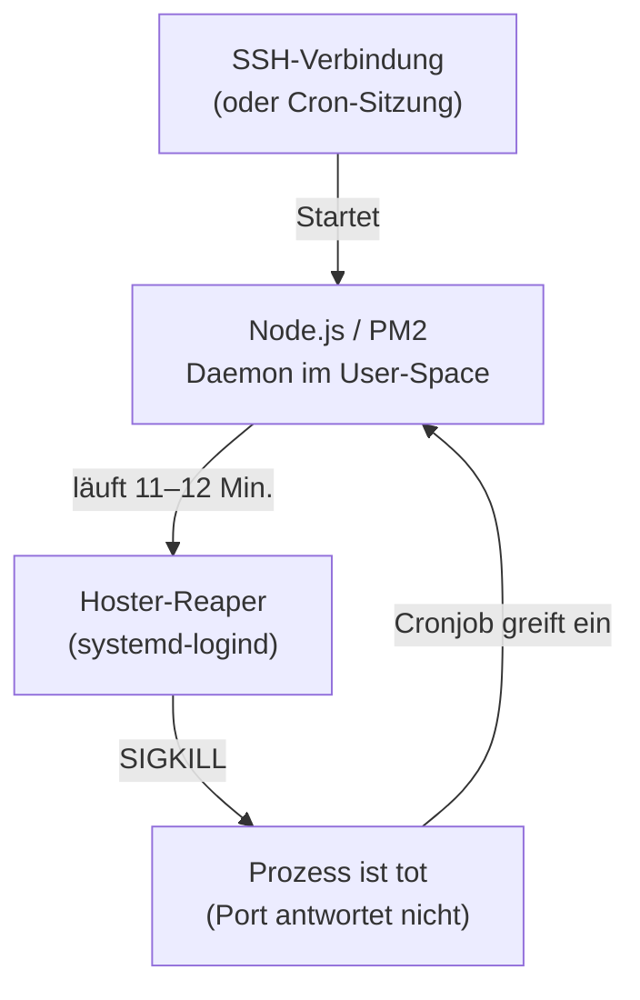
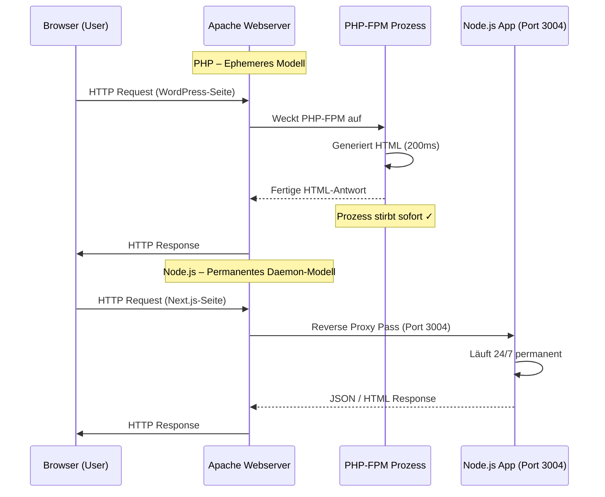
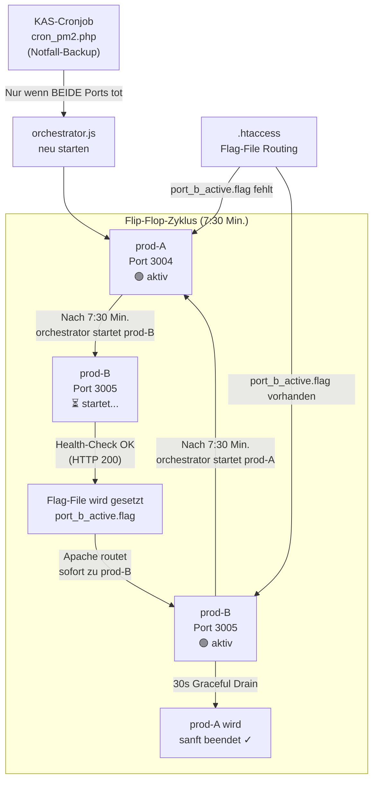
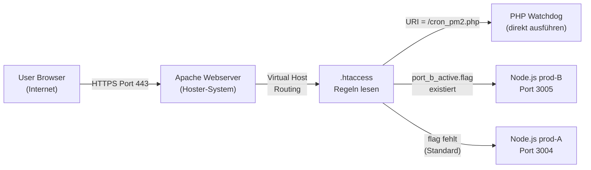
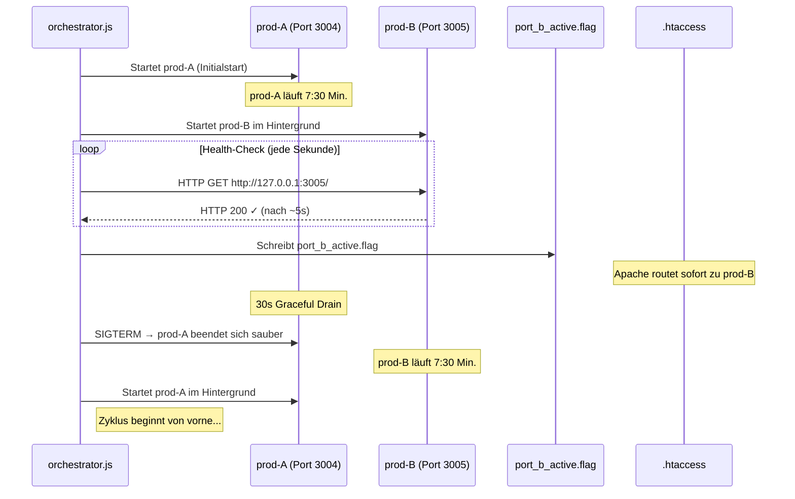
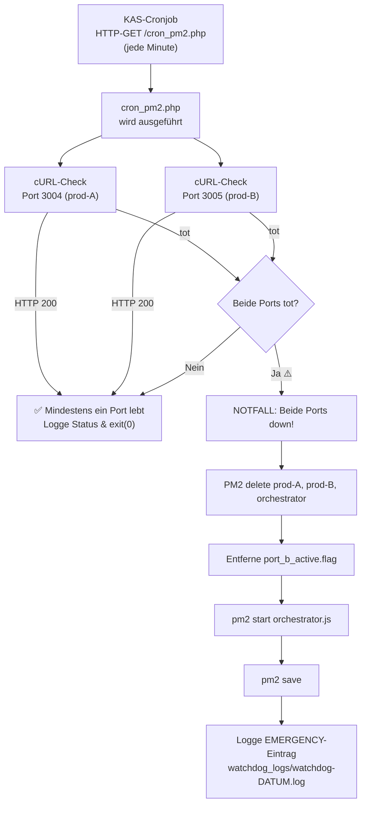

> Stand: 2026-05-18 | Technische Dokumentation & Best Practices
> Zielgruppe: System-Architekten, KI-Agenten, DevOps-Engineers

---

## 1. Architektur-Spezifika & Besonderheit von Shared Hosting

- **Ausgangslage im Shared Hosting**
  - *All-Inkl.com* ist kein isolierter virtueller Server (*vServer* / *VPS*)
  - Mehrere Kunden teilen sich die Hardwareressourcen und denselben Linux-Kernel (`6.8.0-111-generic Ubuntu`)
  - Fehlende `sudo`- bzw. Root-Rechte für Systemdienste (`systemctl` nicht verfügbar)
  - Isolierte SSH-Shell: `SHELL=/usr/local/bin/ssh-bash`

- **Das Problem der flüchtigen Prozesse (Der 11-Minuten-Reaper)**
  - Auf Shared-Systemen beendet die Hoster-Überwachungsroutine inaktive oder ressourcenintensive Hintergrundprozesse
  - Empirisch beobachtetes Intervall bei All-Inkl: **exakt alle 11–12 Minuten**
  - Ein regulär gestarteter Node.js-Prozess läuft nicht garantiert unendlich durch
  - Ursachen: `systemd-logind KillUserProcesses=yes`, RAM-Limits, CPU-Quotas



- **Die Lösungsarchitektur (3 Ebenen)**
  1. **Flip-Flop-Orchestrator** (`orchestrator.js`): Proaktive Rotation alle 7:30 Min. zwischen 2 Ports
  2. **PHP-Watchdog** (`cron_pm2.php`): Minütlicher KAS-Cronjob als Notfall-Defibrillator
  3. **Apache Reverse Proxy** (`.htaccess`): Flag-File-basiertes Zero-Downtime-Routing

---

## 2. Systemarchitektur: PHP vs. Node.js (Ephemerisch vs. Permanent)

Der Hauptgrund, warum Node.js auf Shared-Hosting stirbt, während PHP stabil läuft:



- **PHP** läuft im FastCGI/FPM-Modus unter Apache
  - Existiert nur für die Dauer eines Requests (100–500ms)
  - Kein dauerhafter Hintergrundprozess im Kunden-User-Space
  - Der Apache-Webserver ist ein unantastbarer Systemdienst des Hosters

- **Node.js** bringt seinen eigenen Webserver mit
  - Läuft dauerhaft 24/7 im unprivilegierten User-Space (`ssh-USER`)
  - Belegt permanent Arbeitsspeicher (V8-Engine) und Netzwerk-Sockets (Port `3004`)
  - Stirbt beim Reaper → Site ist offline bis zur Wiederbelebung

---

## 3. Pfadstrukturen & Laufzeitumgebung (All-Inkl)

- **Verzeichnisstruktur bei All-Inkl**

  | Pfad (anonymisiert) | Zweck |
  |---|---|
  | `/www/htdocs/ACCOUNT_ID/` | Web-Root (Hauptverzeichnis aller Domains) |
  | `/www/htdocs/ACCOUNT_ID/DOMAIN/` | Verzeichnis deiner spezifischen Domain |
  | `/www/htdocs/ACCOUNT_ID/DOMAIN/app/` | Next.js Standalone-Build |
  | `/www/htdocs/ACCOUNT_ID/DOMAIN/app/.next/standalone/` | Ausführbarer Server (`server.js`) |
  | `/www/htdocs/ACCOUNT_ID/nodejs_current/bin/` | Node.js Binary & npm |
  | `/www/htdocs/ACCOUNT_ID/.pm2/` | PM2 Daemon State & Logs |

- **Node.js Installation bei All-Inkl**
  - All-Inkl pflegt zentrale Node-Binaries im Kunden-Home
  - Pfad: `/www/htdocs/ACCOUNT_ID/nodejs_current/bin/node`
  - PM2 wird im User-Space installiert: `npm install pm2 -g --prefix ~/.local`
  - Oder via All-Inkl KAS Anwendungs-Installer

- **Kritische Umgebungsvariablen**
  - Da PHP im Web-User-Kontext läuft, kennt es die SSH-Pfade nicht
  - Müssen immer explizit gesetzt werden:

  ```bash
  export HOME=/www/htdocs/ACCOUNT_ID
  export PATH=/www/htdocs/ACCOUNT_ID/nodejs_current/bin:$PATH
  ```

---

## 4. Die Flip-Flop-Architektur (Zero-Downtime Rotation)

Das Kernkonzept: 2 Node.js-Instanzen auf 2 Ports rotieren proaktiv alle 7:30 Minuten – **bevor** der 11-Minuten-Reaper zuschlägt.



### 4.1 Vorteile der Flip-Flop-Architektur

| Aspekt | Beschreibung |
|---|---|
| **RAM-Hygiene** | V8-Speicherlecks akkumulieren sich nie über 7:30 Min. – Garbage Collector hat immer leichtes Spiel |
| **Anti-Reaper** | Prozesse sind nie älter als 7:30 Min. → unter dem 11-Min. Reaper-Schwellwert |
| **Zero Downtime** | `.htaccess` routet erst nach erfolgreichem Health-Check zur neuen Instanz |
| **Graceful Drain** | 30s Drain-Zeit → laufende Downloads/Streams werden nie abrupt getrennt |
| **Redundanz** | Cronjob als Notfall-Backup, falls der Orchestrator selbst stirbt |

---

## 5. Apache Reverse Proxy & `.htaccess` Konfiguration (All-Inkl)



### 5.1 Die vollständige `.htaccess` (Flip-Flop-Variante)

```apache
#AuthUserFile /www/htdocs/ACCOUNT_ID/DOMAIN/.htpasswd
#AuthGroupFile /dev/null
#AuthName "Bitte Benutzer und Passwort eingeben"
#AuthType Basic
#require valid-user

# 1. DirectoryIndex zwingend deaktivieren (MUSS erste Zeile sein)
DirectoryIndex disabled
RewriteEngine On

# 2. Watchdog-Skript: immer direkt als PHP ausführen, NIEMALS proxieren
#    (Wenn Node.js down ist, muss das PHP-Skript trotzdem erreichbar bleiben!)
RewriteCond %{REQUEST_URI} ^/cron_pm2\.php
RewriteRule ^ - [L]

# 3. Wenn port_b_active.flag existiert → prod-B (Port 3005) ist live und ready
RewriteCond %{DOCUMENT_ROOT}/port_b_active.flag -f
RewriteRule ^(.*)$ http://127.0.0.1:3005%{REQUEST_URI} [P,L]

# 4. Standard-Routing: prod-A (Port 3004)
RewriteRule ^(.*)$ http://127.0.0.1:3004%{REQUEST_URI} [P,L]
```

### 5.2 Kritische Fallstricke (All-Inkl-spezifisch)

- **`DirectoryIndex disabled` MUSS die erste Zeile sein**
  - Fehlt diese Zeile, versucht Apache Dateien aus dem Dateisystem auszuliefern
  - Die Node.js-App wird komplett umgangen

- **`[L]` statt `[END]` in RewriteRules**
  - All-Inkl blockiert `[END]` in Kombination mit Proxy-Regeln → führt zu HTTP 500

- **Cronjob-Ausnahme ist absolut kritisch**
  - Ohne `RewriteCond %{REQUEST_URI} !^/cron_pm2\.php` wird der Watchdog selbst durch den Proxy gesendet
  - Wenn Node.js down ist → Apache liefert 503 → Watchdog wird nie ausgeführt → ewiger Ausfall

---

## 6. Der Orchestrator (`orchestrator.js`)

Der Orchestrator ist das Herzstück der Flip-Flop-Architektur. Er läuft als eigenständiger PM2-Prozess.



```javascript
// orchestrator.js – Schlüssel-Parameter
const PORT_A             = 3004;
const PORT_B             = 3005;
const ROTATE_INTERVAL_MS = 7.5 * 60 * 1000; // 7 Minuten 30 Sekunden
const HEALTH_TIMEOUT_MS  = 15 * 1000;        // 15 Sekunden Startzeit-Budget
const DRAIN_TIMEOUT_MS   = 30 * 1000;        // 30 Sekunden für Graceful Drain
const FLAG_B             = WEBROOT + "/port_b_active.flag";
```

---

## 7. Der PHP-Watchdog (`cron_pm2.php`) – Der Notfall-Defibrillator



### 7.1 Log-Rotation (31 Tage)

Täglich wird eine neue Log-Datei angelegt. Die Bereinigung hält maximal 31 Dateien:

```
watchdog_logs/
├── watchdog-2026-05-18.log  ← heute
├── watchdog-2026-05-17.log
├── watchdog-2026-05-16.log
│   ...
└── watchdog-2026-04-18.log  ← älteste (nach 31 Tagen gelöscht)
```

---

## 8. Der KAS-Cronjob (All-Inkl Kundenadministration)


- **KAS-Einstellungen**
  - Typ: URL-Aufruf
  - Intervall: `* * * * *` (jede Minute)
  - URL: `https://DEINE-DOMAIN/cron_pm2.php`
  - Exklusive Ausführung: empfohlen `false`

---

## 9. Empirische Messdaten (Live-Beobachtungen)

Aus den Live-Logs (`watchdog-2026-05-18.log`) ist das Verhalten des All-Inkl-Reapers direkt ablesbar:

| Uhrzeit | Ereignis |
|---|---|
| `15:05:01` | PM2 Daemon komplett gelöscht (Reaper) |
| `15:05:01` | Watchdog erkennt Ausfall, startet Orchestrator neu |
| `15:16:01` | PM2 Daemon erneut gelöscht (exakt 11 Min. später) |
| `15:27:02` | PM2 erneut gelöscht (+11 Min.) |
| `15:39:01` | PM2 erneut gelöscht (+12 Min.) |

- **Beobachtung**: Der All-Inkl Reaper schlägt **exakt alle 11–12 Minuten** zu
- **Schutz**: Durch das 7:30-Min.-Rotationsintervall sind unsere Prozesse **immer jünger als das Reaper-Limit**
- **Fallback**: Der minütliche Cronjob stellt die Site **innerhalb von max. 60 Sekunden** wieder her

---

## 10. Betrieb & Wartungsbefehle via SSH

```bash
# Aktuellen Status aller PM2-Prozesse anzeigen
export HOME=/www/htdocs/ACCOUNT_ID
export PATH=/www/htdocs/ACCOUNT_ID/nodejs_current/bin:$PATH
pm2 list

# Live-Logs beobachten (Orchestrator + prod-A/B)
pm2 logs orchestrator --lines 50
pm2 logs prod-A --lines 50

# Orchestrator manuell (neu) starten
pm2 delete prod-A prod-B orchestrator
rm -f /www/htdocs/ACCOUNT_ID/DOMAIN/port_b_active.flag
pm2 start /www/htdocs/ACCOUNT_ID/DOMAIN/orchestrator.js \
  --name orchestrator --kill-timeout 30000
pm2 save --force

# Watchdog-Logs der letzten 3 Tage prüfen
tail -n 50 /www/htdocs/ACCOUNT_ID/DOMAIN/watchdog_logs/watchdog-$(date +%Y-%m-%d).log
```

---

## 11. Weiterführende Links & Quellen

- Vollständige PM2 Dokumentation: [pm2.io](https://pm2.io/docs/runtime/reference/pm2-cli/)
- Apache `mod_rewrite` Referenz: [httpd.apache.org](https://httpd.apache.org/docs/current/mod/mod_rewrite.html)
- systemd-logind `KillUserProcesses`: [freedesktop.org](https://www.freedesktop.org/software/systemd/man/logind.conf.html)
- Blog-Artikel: [DEINE-DOMAIN/blog/node-js-auf-shared-hosting](/blog/node-js-auf-shared-hosting)
